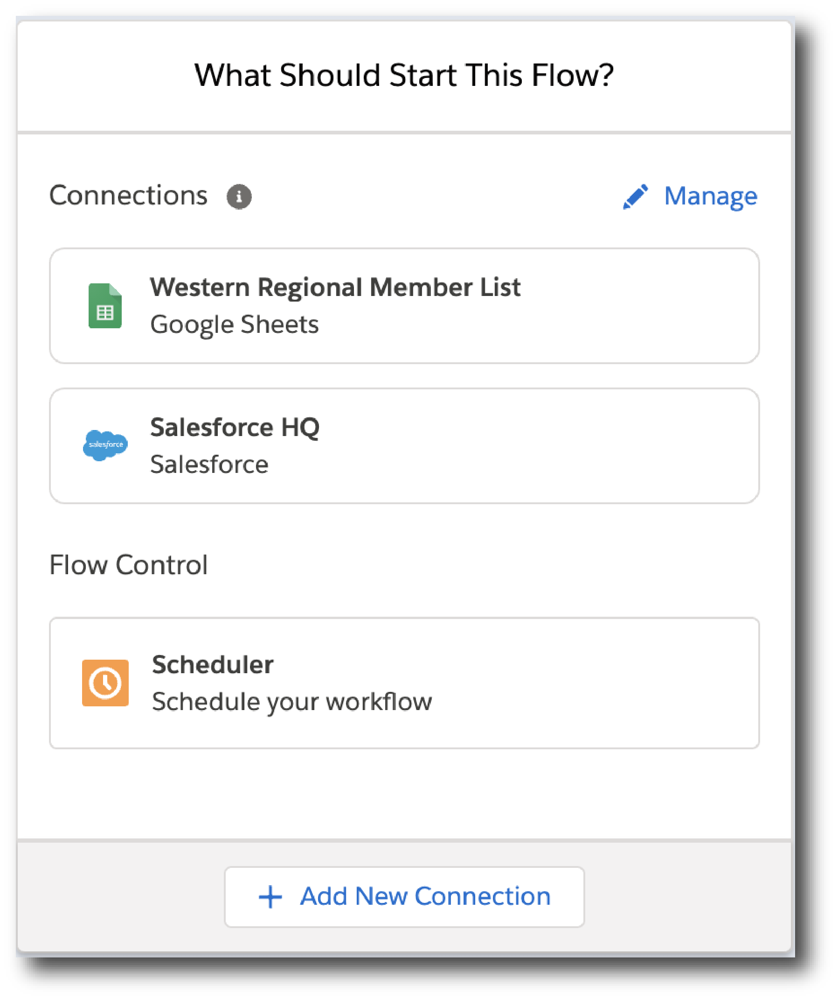
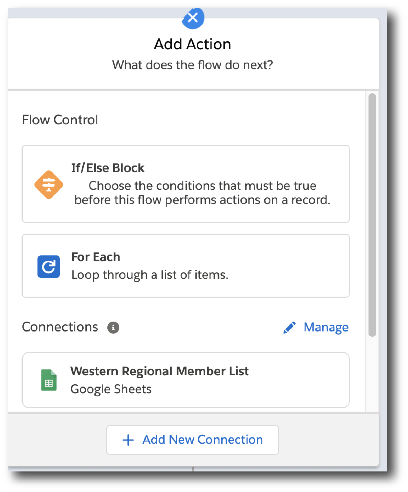
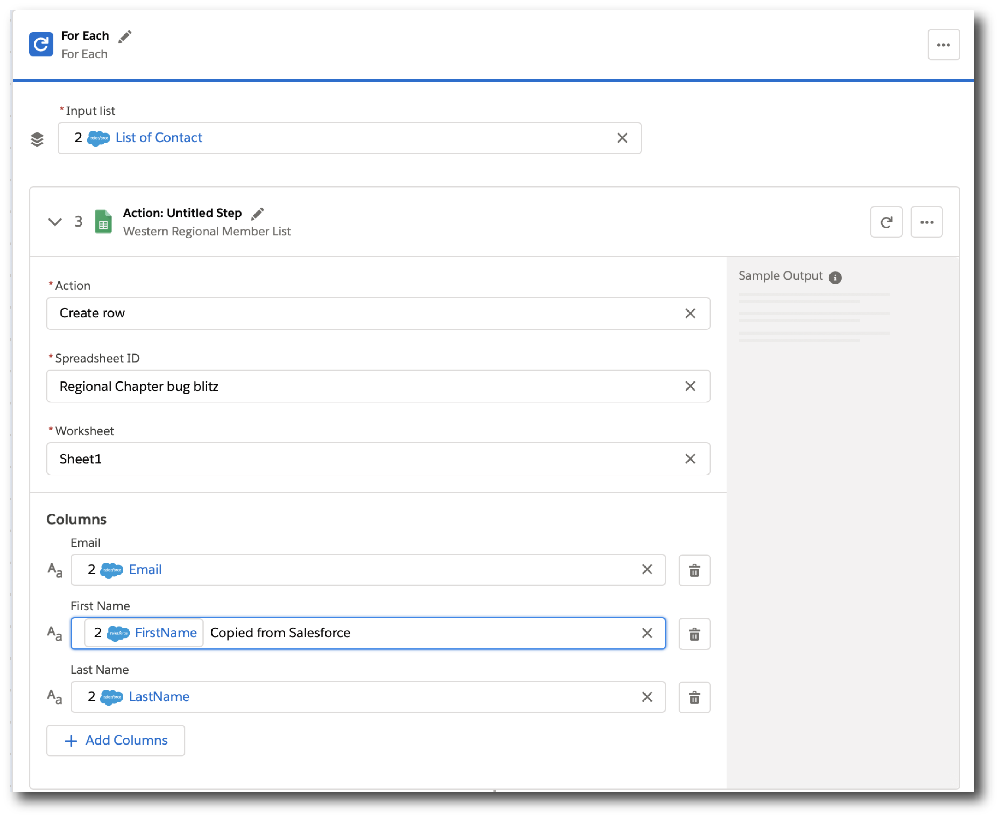
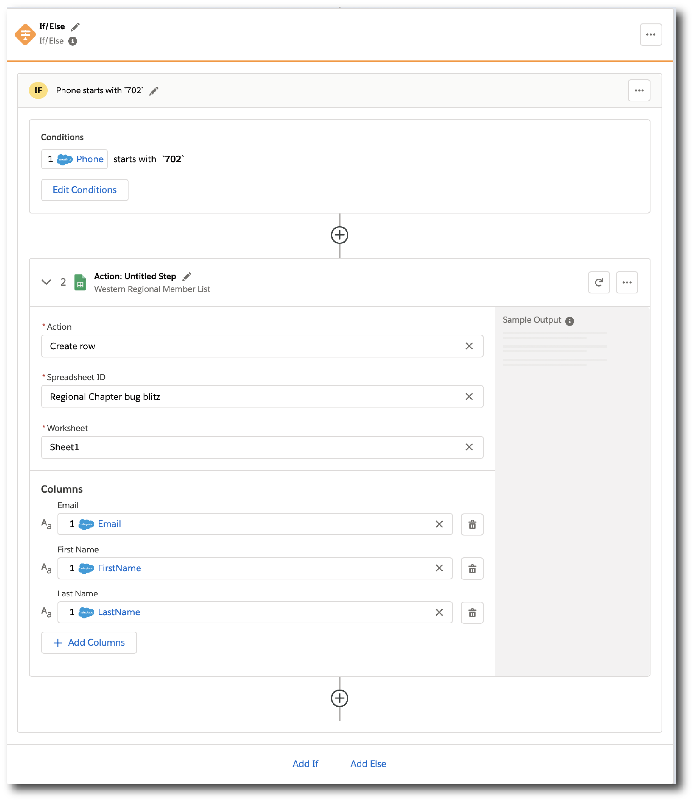

= How Composer Works

A flow defines the automated processes between two or more systems. Think of it as the schema for an entire automation process. For example, you can automate any of these actions with Composer:

* Copy all new records in one Salesforce org and replicate them in another.
* Create employee records or job requisitions in Workday, and populate some of the fields with data from another system.
//* Send a Slack message every time a Google Sheet is updated.
* Check a source of data every fifteen minutes, and if the data changed, copy those changes to a Tableau data source.

You can also combine multiple actions in a single flow, such as replicating Salesforce records and then sending a Slack message to a particular channel based on the record type. Understanding how the basic building blocks of a flow work together makes it easier to confidently build and test flows. Building a flow is a simple matter of adding a trigger and all the actions you want to perform to complete an automated process.

== Connections or Scheduler

After you create and name a flow, you're ready to choose what will trigger the flow: an event in a system such as Salesforce or Workday, or a time interval such as "every fifteen minutes."

Triggering a flow with an event is done with a connection, and triggering with a time schedule is done with Scheduler.

=== Connections

The first step in triggering a flow is connecting to the system where the trigger will occur. In the *What Should Start This Flow* dialog, choose or create a connection as the first step of creating a trigger:

* Choose an existing connection from the list.
* Click *Add New Connection* to create a new connection that is automatically selected after you create it.
* Optionally, you can manage connections: change a connection name or delete a connection.

Connections protect your login credentials while giving easy access to data sources:

* Only you can see the connections you create.
* The credentials are never exposed or accessible after you create the connection.
* You can't change the name of a connection after it is used in a flow that is deployed.

After you choose a connection, Composer displays a dialog for you to finish defining the trigger.
From this dialog, you can change the connection to another of the same system.

=== Scheduler

Instead of connections, you can use *Scheduler* to create a time interval that triggers a flow:

image::images/connection-scheduler.png[New trigger with time interval, 500]

== Triggers

The first step of the flow is always a trigger. The options available depend on which connection or schedule you choose:

* If you choose a time interval instead of an event, you won't see any options: the trigger is finished, and you are ready to create the actions that define what this flow does.
* If you choose a connection, define what kind of data triggers the flow and is fetched, available for the actions you'll define next.

The following example shows a trigger that uses a connection:

image::images/trigger-example.png[Example of a trigger, 500]

* *Trigger* is the name of the trigger, a name you provide.
* *Salesforce Org HQ* is the name of the connection which this trigger uses as the data source.
The trigger listens to the data source and starts when an event specified in the next field occurs, or when a time interval is reached.
* *Start this flow when:* is a list of actions that can start a flow for the chosen connection. Click in the text box to see a list of options.
* *Object type* is a list of objects you can choose, such as account or opportunity for a Salesforce connection. The label here and the choices you are given depend on the connection.
* *Result fields* by default lists the number of fields that will be available to the flow each time it is triggered. To work with only some record fields, click *Select Fields*.
* *Sample Output* shows you the field name and a sample value taken from an actual record in the data source you connected to. Check the sample output to confirm that you've connected to the correct account. It also helps you understand the data that you'll be able to work with.
+
To see the API Name of the field, hover over the information bubble next to each field name.

You can test your trigger and adjust as needed. Simply click *Test*, then make the system event happen: in this example, create a new Salesforce contact. If the test completes without errors, you're ready for the next step: define the actions that this flow will perform after being triggered.

== Actions

An action is a step in the flow. You create the first action of the flow right after the trigger, and as with the trigger, you can choose a connection. You'll have access to the data fetched by the trigger and any previous actions as well.

However, you can also start with a flow control before the action.

In the following example, a Salesforce admin has created an action, named it, and chosen a connection to their Google spreadsheets, as you can see in the top banner of the action. The admin has also defined the action: in this case, create a new row in a spreadsheet and populate it with some fields from the flow trigger (each new contact record).

image::images/action-step1.png[Example action, 600]

* *Action* is the task you want to perform. The actions you can choose from depend on which connection you choose.
+
The rest of the fields in this section depend on the connection type, and the action you choose.
* *Spreadsheet ID* is the name of the spreadsheet this action will use. You can search for and select any of the spreadsheets that you can access using the credentials you used to create the connection.
* *Worksheet* is the name of the worksheet where you will add a row.

* *Columns* is the area where you map the trigger fields to columns in the spreadsheet. This area, like the others, is different for different systems. In this example, click *Add Columns* to see all the columns from the spreadsheet listed and choose the ones you want to work with here:
+
image::images/action-step2.png[Example action, 600]
+
Choose which fields you want to act upon, and then map the fields you fetched with the trigger or previous actions with these:
+
image::images/action-step3.png[Example action, 600]
+
Map the fields delivered by the trigger to the spreadsheet rows you selected. In this example, *Email*, *FirstName*, and *LastName* will be mapped to the Google sheet columns *Email*, *First Name*, and *Last Name*. You don't have to map all the fields fetched in your action  or trigger connection.
+
Remember, the selection pane (*Columns*) is different depending on the connection for this action and other choices. For a list of valid actions for each connection, see the reference topic for the system you are interested in.

This is the complete action, ready for testing:

The fields from Salesforce that are mapped to the Google Sheet fields are data pills, containers for everything that might be in a field (or other resource, depending on the connection).

== Data Pills

Data pills allow your data mapping to be as simple or as complex as you need:

* Data pills contain the complexity of a data structure, making it easy map data from triggers or previous actions.

* You can concatenate two or more data pills by mapping them to the same field, column, or other data target.

* You can create a custom expression instead of simply mapping data pills to data targets, by select *Custom Express fx*. For example, you might want to add some text such as `Copied from Salesforce` after a data pill, to flag it for inspection.

If a data pill is a field with a null or blank value, and you map it to an optional field, Composer removes it from the flow. If you map it to a required field, an error occurs because a value is required.

== Flow Controls

If you need to add logic to your flow beyond a basic action, you can use a For Each loop or an If/Else block. You'll define the flow control and then specify the action to be taken based on the logic applied to the data fetched previously.

=== For Each Loop

A For Each loop acts on each record in a list. For example, if the flow fetches a set of contacts from Salesforce, you can loop through the list and copy each record to a row in a Google Sheet.

*Input list* is chosen from the list of records available from a previous action. In this example, a previous action fetched all the contact records associated with a single account.

The rest of the steps are the actions that are to be performed on each record in the list. In this example, the action writes contacts to a Google Sheet, one record per row.

=== If/Else Block

An If/Else block takes a single record and checks to see if it meets conditions you specify. If it does, you define what actions to take.

This example shows only one If branch: if the phone number on the record starts with `702`, then the first and last names are copied to a row in a Google Sheet. If a record doesn't meet the criteria, no action is taken, and the flow moves on to the next action, since there is only one branch.

You can add up to 20 conditions per branch and as many actions per branch as you need. Click *Add If* to add branches. After specifying all the branches you need, you can specify a fall-through action with *Add Else*.

Be careful how you order your If statements. The action specified by the first branch whose conditions are met is the only action performed in the If/Else block.

== Test Each Step

You can test your work after every trigger and action. As you test, you can add or delete triggers, actions, and flow controls. You can also change the connection you use in triggers or actions to another connection of the same system type.

After testing is complete, you are ready to activate your flow.

== See Also

* xref:ms_composer_overview.adoc[Mulesoft Composer for Salesforce: Overview]
* xref:ms_composer_prerequisites.adoc[MuleSoft Composer for Salesforce: Getting Started]
* xref:ms_composer_flows.adoc[Build and Test a Flow]
* xref:ms_composer_activation.adoc[Activate a Flow]
* xref:ms_composer_monitoring.adoc[Monitor a Flow]
