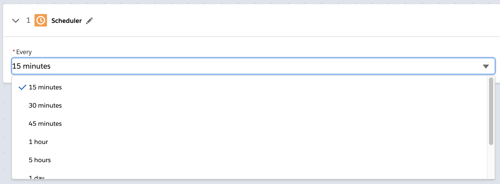

= How Composer Works

A flow defines the automated processes between two or more systems. Think of it as the schema for an entire automation process. For example, you can automate any of these actions with Composer:

* Copy all new records in one Salesforce org and replicate them in another.
* Create employee records or job requisitions in Workday, and populate some of the fields with data from another system.
//* Send a Slack message every time a Google Sheet is updated.
* Check your Tableau data every fifteen minutes, and if the data changed, copy those changes to a different Tableau data source.

You can also combine multiple actions in a single flow, such as replicating Salesforce records and then sending a Slack message to a particular channel based on the record type. Understanding how the basic building blocks of a flow work together makes it easier to confidently build and test flows. Building a flow is a simple matter of adding a trigger and all the actions you want to perform to complete an automated process.

After you create and name a flow, you're ready to add a connection.

== Connections or Scheduler

The first step of every flow is to create a new connection or choose an existing one, or to define a schedule, a time interval that triggers the flow:

image::images/connection-example.png[Example of a connection dialog, 400]

For each flow, the first step is choosing either *Scheduler* or *Connections*:

* Use the *Connections* section to do one of the following:

    ** Choose an existing connection from the list. Authentication details are hidden; you can see the name of the connection, and the system it works with, but not the credentials.
    ** Click *Add New Connection* to create a new connection that is automatically selected after you create it.
    ** Optionally, you can manage connections: change the name or delete the connection.

* Use *Scheduler* to create a time interval that triggers the flow:
+

Connections protect your login credentials while giving easy access to data sources:

* Only you can see the connections you create.
* The credentials are never exposed or accessible after you create the connection.
* You can't remove a connection until you've removed every reference from it from every flow.
* You can't change the name of a connection after it is used in a flow that is deployed.

After choosing the connection or time interval, finish defining the trigger.

== Triggers

The first step of the flow is always a trigger. The options available depend on which connection or schedule you choose:

* If you choose a time interval instead of an event, you won't see any options: the trigger is finished, and you are ready to create the actions that define what this flow does.
* If you choose a connection, define what kind of data triggers the flow and is fetched, available for the actions you'll define next.

The following example shows a trigger that uses a connection:

image::images/trigger-example.png[Example of a trigger, 600]

* *Trigger* is the name of the trigger, a name you provide.
* *Salesforce Org HQ* is the name of the connection which this trigger uses as the data source.
The trigger listens to the data source and starts when an event specified in the next field occurs, or when a time interval is reached.
* *Start this flow when:* is a list of actions that can start a flow for the chosen connection. Click in the text box to see a list of options.
* *Object type* is a list of objects you can choose, such as account or opportunity for a Salesforce connection. The label here and the choices you are given depend on the connection.
* *Result fields* by default lists the number of fields that will be available to the flow each time it is triggered. To work with only some record fields, click *Select Fields*.
* *Sample Output* shows you the field name and a sample value taken from a random record in the data source you connected to. It's just there to show you what's available for use in the flow. To see the API Name, click the information bubble next to each field name.

Now that you know what triggers the flow to run, and what data is fetched, you are ready to define the actions: what the flow does.

== Actions

An action is a step in the flow. You create the first action of the flow right after the trigger, and as with the trigger, you choose a connection. You'll have access to the data fetched by the trigger as well.

In the following example, a Salesforce admin has created an action, named it, and chosen a connection to their Google spreadsheets, as you can see in the top banner of the action. The admin has also defined the action: in this case, create a new row in a spreadsheet and populate it with some fields from the trigger: in this case, each new Salesforce contact.

* *Action* is the task you want to perform. The actions you can choose from depend on which connection you used when you created the action. Naming the action may make your flow easier to understand.
+
The rest of the fields in this section depend on the connection type and the action you choose.
* *Spreadsheet ID* is the name of the spreadsheet this action will use. You can search for and select any of the spreadsheets that you can access using the credentials you used to create the connection.
* *Worksheet* is the name of the specific worksheet in the spreadsheet where you will add a row.

* *Columns* is the area where you map the trigger fields to columns in the spreadsheet. Click *Add Columns* to see all the columns from the spreadsheet listed:
+

+
Choose which fields you want to act upon, and then map the trigger-delivered fields with these:
+

+
Map the fields delivered by the trigger to the spreadsheet rows you selected. In this example, *Email*, *FirstName*, and *LastName* will be mapped to the Google sheet columns *Email*, *First Name*, and *Last Name*.
+
Depending on the flow trigger and other choices, this selection pane presents different items.

The complete action, ready for testing:

image::images/action-overview.png[Example action, 600]

Actions can do many more things than the simple example shown here. Actions can:

* Start with a connection or a scheduled interval of time, just like triggers.
* Contain For Each or If/Else statements, also called logic or conditional logic.
* Contain data mapping from the trigger or other system that you specify using a connection. You can modify the data as well as map it.
* Work with complex data, not just simple field values.
* Contain instructions to perform tasks like deleting a record.
* Contain other actions.
* Work with more than fields, depending on the connection. For example, with the Tableau connection you can replace an entire hyper file of data, and the Salesforce connection allows you to create or delete entire records.

For a list of valid actions for each connection, see the reference topic for the system you are interested in.

Let's take a closer look at other elements you can use in an action.

=== For Each or If/Else

You can add a For Each or If/Else block to an action:

* A For Each block loops iterative over each item. For example, if you define an action to fetch a set of records from Salesforce, you'd want to go through the records and make sure you only took action on those that meet certain criteria.
* An If/Else block takes a single record and checks to see if it meets the conditions you specify. If it does, you define what actions to take.

=== Mapping Data with Data Pills

Many actions map data from a data source to a data target, as the previous example illustrated, mapping Salesforce contact fields to a Google spreadsheet. The mapping is done using a data pill, a container for everything that might be contained in a field (or other resource, depending on the connection). The data pill allows you to map complex data structures.

Data mapping is flexible in Composer:

* You don't have to map all the fields fetching in your action connection or in the trigger connection.
* You can create a custom expression instead of simply mapping fields.  Select *Custom Express fx* when mapping a field to create a custom expression. For example, you might want to add some text like `Copied from Salesforce`after a field, to flag it for inspection.
* Because fields are fetched in the form of data pills, you can use compound or nested fields in your flows.