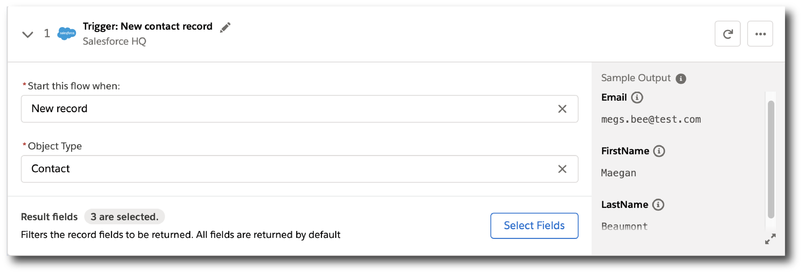

= About Composer Flows

Flows define the automated processes between two or more systems.

For example, you can automate any of these actions with Composer:

* Copy all new records in one Salesforce org and replicate them in another.
* Send a Slack message every time a Google Sheet is updated.
* Check your Tableau data every fifteen minutes, and if the data changed, copy those changes to a different Tableau data source.

You can also combine multiple actions in a single flow, such as replicating Salesforce records and then sending a Slack message to a particular channel based on the record type. Understanding how the basic building blocks of a flow work together makes it easier to confidently build and test flows. Building a flow is a simple matter of adding a trigger and all the actions you want to perform to complete an automated process.

After you create and name a flow, you're ready to add a connection.

== Connections

When you first create a flow, you're asked to create a new connection, select an existing one, or choose a timer interval that will trigger the flow.

image::images/connection-example.png[Example of a connection dialog, 400]

Choose either *Scheduler* or *Connections*:

* Use the *Connections* section to do one of the following:

    ** Choose an existing connection from the list. Authentication details are hidden; you can see the name of the connection, and the system it works with, but not the credentials.
    ** Click *Add New Connection* to create a new connection that is automatically selected after you create it.
    ** Optionally, you can manage connections: change the name or delete the connection.

* Use *Scheduler* to create a time interval that triggers the flow:
+
image::images/connection-scheduler.png[New trigger with time interval, 600]

After you choose a time interval or connection, that item is added to a trigger and displayed.
For example, the following trigger results from choosing or creating a connection to Google Sheets:

image::images/connection-trigger.png[New trigger with connection, 600]

Name the trigger now or later, or leave it unnamed. As you work on the flow, you can go back and rename the trigger if needed.

== Triggers

The first step of the flow is always a trigger. The options available depend on which connection you used. If you chose a time interval instead of an event, you won't see any options.

The following example shows a trigger based on an event:

* *Trigger* is the name of the trigger, a name you provide.
* *Salesforce Org HQ* is the name of the connection which this trigger uses as the data source.
The trigger listens to the data source and starts when an event specified in the next field occurs, or when a time interval is reached.
* *Start this flow when:* is a list of actions that can start a flow for the chosen connection. Click in the text box to see a list of options.
* *Object type* is a list of objects you can choose, such as account or opportunity for a Salesforce connection. The label here and the choices you are given depend on the connection.
* *Result fields* by default lists the number of fields that will be available to the flow each time it is triggered. To work with only some record fields, click *Select Fields*.
* *Sample Output* shows you the field name and a sample value taken from a random record in the data source you connected to. It's just there to show you what's available for use in the flow. To see the API Name, click the information bubble next to each field name.

The rest of the flow is defined in the actions.

== Actions

Add info about actions, including data pills and conditional steps.