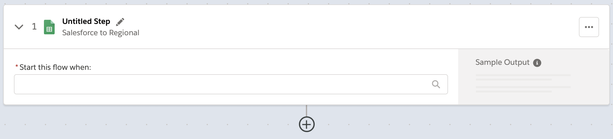

= About Composer Flows

Flows define the automated processes between two or more systems.

For example, you may want to:

* Copy all new records in one Salesforce org and replicate them in another.
* Send a Slack message every time a Google Sheet is updated.
* Add information to a Tableau data source.

You can also combine multiple steps in a single flow, such as replicating Salesforce records and then sending a Slack message to a particular channel based on the record type. Understanding how the basic building blocks of a flow work together makes it easier to confidently build and test flows. Building a flow is a simple matter of adding a trigger, then all the actions you wish to perform to complete an automated process.

To create a flow, simply select *New Flow* from the Composer *Composer Flows* tab. Now you are ready to define your flow.

== Connections

When you first create a flow, you're asked to create a new connection, select an existing one, or choose a timer interval that will trigger the flow.

image::images/connection-example.png[Example of a connection dialog, 400]

* Use the *Connections* section to do one of the following:

    ** Choose an existing connection from the list. Authentication details are hidden; you can only see the name of the connection, and the system it works with.
    ** Click *Add New Connection* to create a new connection that is automatically selected after you create it.
    ** Optionally, you can manage (edit the name or delete) connections as well.

* Use *Scheduler* to create a time interval for when the flow is triggered:
+
image::images/connection-scheduler.png[New trigger with time interval, 600]

After you choose a time interval or connection, that item is added to a trigger and displayed.
For example, the following trigger results from choosing or creating a connection to Google Sheets.

Name the trigger now or later, or leave it unnamed. As you work on the flow, you can go back and rename the trigger if needed.

== Triggers

The first step of the flow is always a trigger. The options available depend on which connection you used.

A trigger can be an event, like "a new record is created," or you can define a time period to be the trigger, like "every ten minutes." This time period is called a scheduler. Choose it instead of a connection. You'll add a connection to the first step of the action instead.

image::images/trigger-example.png[Example of a trigger, 600]

* *Trigger* is the name of the trigger, a name you provide.
* *Salesforce Org HQ* is the name of the connection where this trigger listens for when it should start the flow.
* *Start this flow when:* is a list of actions that can start a flow for the chosen connection. Click in the text box to see a list of options.
* *Object type* is a list of objects you can choose, such as account or opportunity for a Salesforce connection. The label here an the choices you are given depend on the connection.
* *Result fields* by default lists the number of fields that will be available to the flow. To work with only some of the record fields, click *Select Fields*.
* *Sample Output* shows you the field name and a sample value taken from a random record in the data source you connected to. It's just there to show you what's available for use in the flow. To see the API Name, click the i-button next to each field name.

The rest of the flow is defined in the actions.

== Actions

Add info about actions, including data pills and conditional steps.