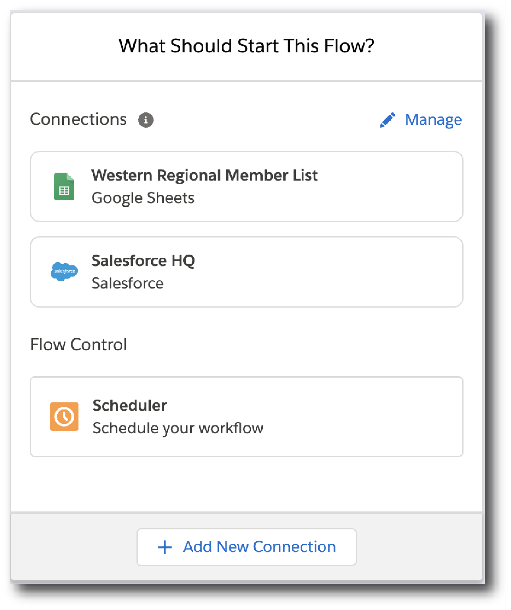
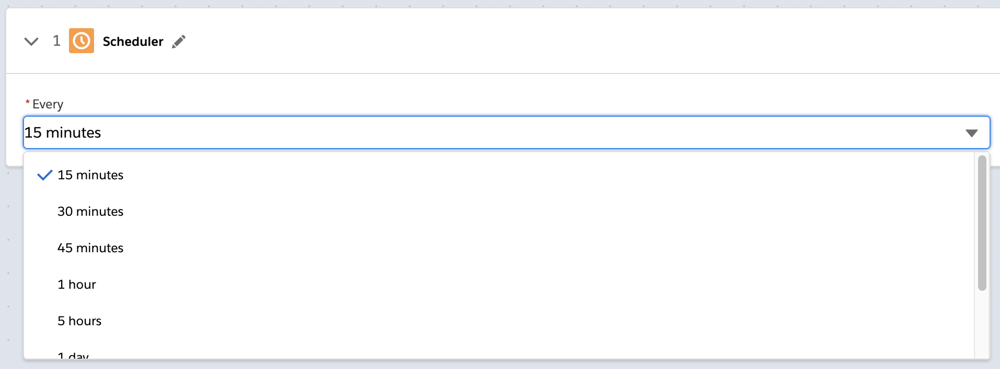

= Build a Composer Flow

After you collect the information described in xref:ms_composer_checklist.adoc[the preparation checklist], you can then build, xref:ms_composer_activation.adoc[activate], and xref:ms_composer_monitoring.adoc[monitor] your flows. Building a flow involves creating a new flow or cloning an existing flow; adding and testing a trigger; adding and testing each action to be performed by the flow, in the order that you want each action performed; and finally testing the completed new flow before activating it.

xref:ms_composer_test_flow.adoc[Test] each trigger and action as you add it to your flow.

== Create a Flow

You can create a new flow or clone an existing flow.

=== Create a New Flow

To create a new flow:

. From the Composer *Home* page, click *Create New Flow*. +
Your flow is named automatically.
. Optionally, click the pencil icon next to *_flow name_* to rename the flow. Valid characters: A-Z, a-z, 0-9, space, hyphen ( - ), dot ( . ), and underscore ( _ ).
. Click *Save*.

Now you are ready to create a flow trigger.

=== Clone an Existing Flow

To clone an existing flow:

. From the *Composer Flows* tab, click the name of the flow you want to clone. Composer displays the Flow Details page.
. Click *Clone*.
. Composer copies the existing flow and opens the copy in the Flow Details page. Notice the flow is named *Copy of _original flow name_*.
. Optionally, click the pencil icon next to *Copy of _original flow name_* to rename the flow. Valid characters: A-Z, a-z, 0-9, space, hyphen ( - ), dot ( . ), and underscore ( _ ).
. Click *Save*.

== Create a Flow Trigger

After you create or clone a flow, define the trigger: the event or time interval that starts the flow. A trigger step is required to test or activate your flow.

To define a trigger based on an event:

. Open a flow if it is not already open. The *What Should Start This Flow?* dialog is displayed.
+

. Select the system where the triggering event occurs. Your existing connections are displayed.
+
image:images/list-of-connections.png[List of connections, 500]
+
You can choose an existing connection or create a new one:

* Click an existing connection to select it.
* Click *Add new Salesforce Connection* to create a new connection and select it. +
You can rename or delete connections from this dialog by clicking the gear icon.

. After you choose a connection, the trigger step displays:
+
image:images/trigger-definition.png[Trigger step, 600]
+
Your trigger is named automatically. All triggers are named by combining the event or operation with the system name. For example, "On new record in Salesforce".

* Optionally, you can rename the trigger. Valid characters: A-Z, a-z, 0-9, space, hyphen ( - ), dot ( . ), and underscore ( _ ).

* Choose an event that starts the flow. Supply additional information as requested.

* Click *Save*.

[[change-a-connection]]
== Change a Connection

You can change connections in a trigger or action. For example, you can create a flow using connections to a Salesforce sandbox org, and then after your flow testing is complete, you can change the connection in your trigger and actions to use a production org.

You can only change to a connection accessing the same system type. You can't change a Workday connection to a Google Sheets connection, for example.

To change a connection:

. Open the flow.
. Click the change icon in the trigger or action that connects to a sandbox:
+
image::images/change-connection.png[Change the connection control, 400]

. Choose a new connection and click *Save*.

== Schedule a Flow

If you don't choose a connection, you can schedule a flow to start at regular intervals.

To create a flow control:

. In a new flow, from the *What Should Start This Flow?* dialog, look in the Flow Control section and click *Scheduler*.
+

. Choose one of the time intervals, from 15 minutes to 30 days.
+

. Click *Save*.

After creating the trigger, add one or more actions to the flow. To apply logic to an action, prepend it with an <<create-an-if-else-block,If/Else block>> or <<create-and-test-a-for-each-loop,For Each>> loop.

== Create an Action

To create an action:

. After the trigger in your flow, click the large plus sign to open the *Add Action* dialog.
. Click or create a connection for the action.
+
For example, if your trigger is "new records created in Salesforce," and you want your action to be "copy new record to a Google Sheet," then you would choose or create a Google Sheet connection.
. Select an action, and any other values displayed. What you have to specify for an action depends on system type you are connected to for the action.
. Click *Save*.

== Create a Flow Control

If you need to perform some logic before an action, select a flow control first:

. After the trigger in your flow, click the large plus sign to open the *Add Action* dialog.
. Click either *If/Else Block* or *For Each*. An If/Else block is good when you need to do different actions depending on one or more conditions. A For Each loop is good for processing a set of records.
. Complete the flow control, which usually includes adding an action.
. Click *Save*.

[[create-an-if-else-block]]
=== Add an If/Else Block

You can create an If/Else block to set conditions and execute actions only when specific criteria are met. This enables you to create flows that cover more than one linear branch, without the need to create separate flows.

Branches are logic-based steps that run vertically in a flow. You can add multiple steps inside each branch. Each branch is then executed in sequential order.

When adding decision steps, the values in the *Field* list are populated based on values selected when you designate the previous steps of your flow. After the *Field* value is selected, all compatible value options appear in the <<supported-operators,*Operator*>> list. If the selected *Operator* requires a second data pill to complete the condition, then the *Value* field is enabled and the list is populated based on the values you selected when defining the trigger. In the *Value* field, you can either enter a value manually or you can set it using the existing data from your flow.

For the purposes of comparing flows, if you initiate a date comparison when building a flow and there is no value in one of the date fields, the missing value is updated to `0001-01-01` by default.

The following operators are supported when building conditions in an If/Else block:

[[supported-operators]]
[%header%autowidth.spread]
|===
|Function | Supported Data Type | Value Required? | Notes
|Equals/Does not equal | All | Yes |The value in this field is case-sensitive for strings.
|Contains/Does not contain | Array, String | Yes | None
|Greater than/Less than |  Date, Number | Yes | In the *Date* field, the *Greater than* value is equal to a later date and the *Less than* value is equal to an earlier date.
|Greater than or equal/Less than or equal | Date, Number | Yes | In the *Date* field, the *Greater than or equal* value is equal to a later date or the current date and the *Less than or equal* value is equal to an earlier date or the current date.
|Is empty/Is not empty |Array, String, Object | No | None
|Starts with/Ends with | String | Yes | A string value for this field is required.
|Is true/Is false | Boolean | No | None
| Is present/Is not present | All | No | If the value in this field is null or if there is no value selected, then the value in this field is set to *Not present* by default.
|===

To create an If/Else block:

. Click the plus sign after the trigger or the last action in your flow.
. Click *Add Action*.
. Click *If/Else Block* to define the first branch.
. Enter the requested criteria.
. Click *+* to add an action to that branch. Every branch must have an action, also called a _step_.
. If you want to add another branch, click *Add If* and repeat the previous steps for every If/Else branch you create.
. If you want to set criteria for how the flow executes if none of the criteria for the existing branches are met, click *Add Else* and repeat the previous steps for the final branch.
. If you want to add additional conditions to your If/Else block, click *Add condition*.
. After you add all the branches, click *Save*.

[[create-and-test-a-for-each-loop]]
=== Create a For Each Loop

To create a For Each Loop:

. Click the plus sign after the trigger or the last action in your flow.
. Click *Add Action*.
. Click *For Each*.
. Choose a data pill from the *Input list*. You must have a trigger or action that returns a set of records or there won't be anything to choose here.
. Click the plus sign to add an action.
. After you complete the action, click *Save*.

You can add logic and actions in different patterns, depending on what your flow needs to do.

include::_partials/see-also.adoc[]
