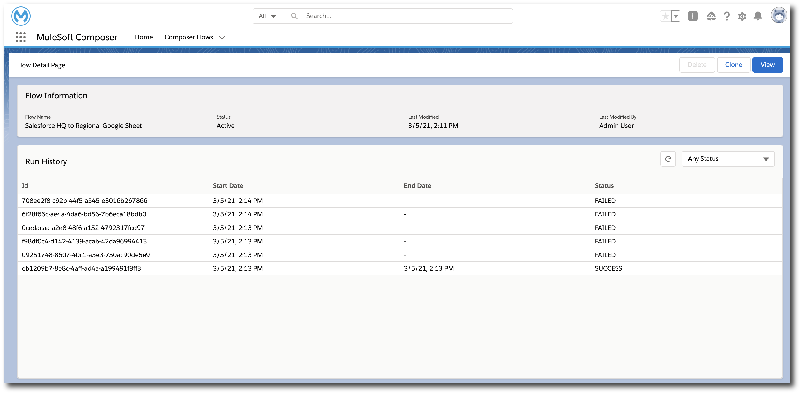

= Monitoring Composer Flows

After activation, you can easily monitor active Composer flows.

. Click *Composer Flows*.
. Click the name of a flow.

The Flow Detail page shows the flow's run history: each time the flow fired, and whether it was successful or not:

