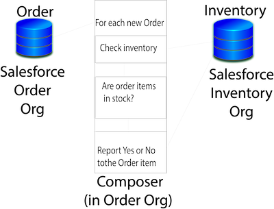

= MuleSoft Composer for Salesforce

MuleSoft Composer for Salesforce (Composer) makes it easy to build process automation for
data, using clicks instead of code from within your Salesforce org.
When you create a secure process to connect the information stored in different systems, you build a real-time,
integrated view of your customers and your business.

To automate processes with Composer, you build a flow that contains every step in the process:

* Selecting the data that you specify from a system such as Google Sheets, Tableau, Workday, or a Salesforce org
* Performing actions on the data, such as copying it to another system

You choose when to trigger the flow: when something happens, like a change to a record or row, or at intervals of time that you specify. Flows can be as simple or complex as your business needs.

== Example

Imagine that a regional Slack user-group tracks its local members in a spreadsheet. Slack users register with the national organization first. Since the national office uses Salesforce to track membership, automatically pushing new members to the regional sheet would save everyone a lot of time. Using Composer, the Salesforce admin can create a single flow that automatically performs this task in near real-time.

This simple flow can be expanded to perform more complex actions, such as writing to different sheets based on
the zip code of the new user or propagating changes for existing users.

== Steps To Create a Flow

To create a functioning, real-time integration in Composer, you don't need coding experience.
Simply open Composer in your Salesforce org, and then create a flow that contains all the steps you need to get data from point A to point B:

Step 1: Choose or create a connection::

A connection is the username and password you'll use to access the data you want to work with, plus the URL where you
typically enter those credentials. Some systems require a few additional pieces of information, such as a security token.
+
After you define the connection, you can use it multiple times in the same flow or in different flows that you create.
Composer never exposes your credentials, and the connections are available only to you, even if other people are also building flows.
+
Instead of a connection, you can choose to schedule a time when the flow runs, such as every 10 minutes.

Step 2: Choose a trigger::

Every flow that uses a connection starts with a trigger: an event such as creating a new record.
This event always triggers the flow to run. The events available to trigger a flow depend on the connection you choose.
+
If a scheduled time is chosen instead of a connection, no trigger is needed, because the flow runs
at the chosen interval.

Step 3: Define the actions you want to take::

Define what happens to the data fetched by the trigger, and when those actions should be taken; for example, to fetch all records for a specific time period but only copy over the records that have changed or that are new. You might also want to copy over only some information from each record, rather than the entire record.
+
Using the triggers and actions of Mulesoft Composer for Salesforce, you can make the flow as elaborate or as simple as necessary.
+
If you start the flow at a specified time interval instead of choosing a connection, then you'll fetch data as part of the first action.

Step 4: Test your flow on one record::

As you define triggers and actions, you see sample data that helps you verify you are building the right steps.
You can test every change before making the next one, making it easier to find and correct issues with your flow.
Your changes will not appear until you activate the flow.

Step 5: Activate the flow::

After testing, activate the flow in your production org.
After the flow is activated, it automatically runs when the conditions in the trigger are met.

Step 6: Monitor the behavior of your flow::

You can see what your flow is doing by looking at the data provided on the flow detail page in Composer.

Mapping data between systems and doing exactly the right thing at the right time sometimes feels complicated;
however, using Composer helps you break down the logic into the steps required.
You can experiment with a flow until you've got it working just right, and you can add complexity to it as you discover new use cases.

== Next Steps

. Review xref:ms_composer_about_flows.adoc[How Composer Works] to understand how the different parts of a flow work together to automate processes. If you want more help, you can use Salesforce Trailhead or visit the MuleSoft blog post about Composer.
. Create a plan for your first flow using the xref:ms_composer_checklist.adoc[checklist].
. Open Composer in your Salesforce org and build your first flow.

== Additional Learning Resources

* https://trailhead.salesforce.com/content/learn/modules/mulesoft-composer-install-and-config/[Trailhead: MuleSoft Composer Installation and Configuration^]
* https://trailhead.salesforce.com/content/learn/modules/mulesoft-composer-basics/[Trailhead: MuleSoft Composer Basics^]
* https://blogs.mulesoft.com/biz/news/introducing-mulesoft-composer/[MuleSoft blog post^]

== See Also

* xref:ms_composer_prerequisites.adoc[Getting Started]
* xref:ms_composer_reference.adoc[Composer Connector Reference]
* https://help.salesforce.com/s/search-result?language=en_US&f%3A%40sflanguage=%5Bes%5D&sort=relevancy&f%3A%40sfkbdccategoryexpanded=%5BAll%5D&t=allResultsTab#t=allResultsTab&sort=date%20descending&f:@objecttype=%5BKBKnowledgeArticle%5D&f:@sflanguage=%5Ben_US%5D&f:@sfkbdccategoryexpanded=%5BAll,MuleSoft%20Composer%5D[Knowledge Articles]
