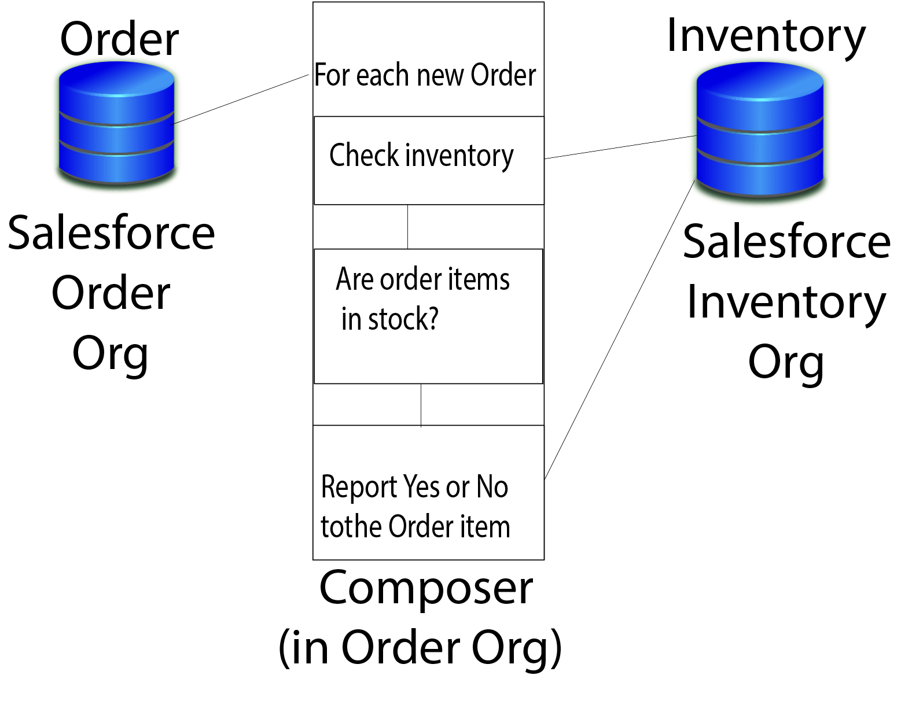

= MuleSoft Composer for Salesforce

You need to make timely business decisions using the most up-to-date data.

However, the data you need is often locked up in different systems.
Integrating these systems and data is a time-consuming, manual process,
and one that has to be repeated each time your organization adds a new system or app to the mix.
Many organizations need IT or line-of-business development teams to integrate systems and data and automate the whole process.
The dependency puts a strain on IT organizations and development teams already stretched thin
by growing business demands and shrinking IT resources.

MuleSoft Composer for Salesforce (Composer) solves this problem. Composer makes it easy to build process automation for
data with clicks instead of code from within your Salesforce org.
When you create a process to connect information stored in different apps or services, you build a real-time,
integrated view of your customers and your business.

When you use Composer, you build a process that selects information from a source
such as Google Sheets, NetSuite, Tableau, or even another Salesforce org.
Then, you map the data (and optionally transform it) for delivery to a target.
You choose which data source is the source of record.
You also choose when the process runs: when something happens, like a change to a record or row, or at intervals of time that you specify.

For example, imagine that a regional Slack user-group tracks its local members in a spreadsheet. The national organization
uses Salesforce to track membership. With Composer, the national team can write membership updates directly to the regional spreadsheet with Composer.

//.Data integrated between data source and data target

To create a functioning, real-time integration in Composer, you don't need coding experience.
Simply open Composer in your Salesforce org and create a flow that contains all the steps you need to get data from point A to point B:

Step One: Choose or create a connection::

A connection is the username and password you'll use to access the data you want to work with.
Once defined, you can use this connection as often as needed.
Composer never exposes your credentials, and the connections are available only to you, even if other people are also building flows.

Step Two: Choose a trigger::

Every flow stars with a trigger--an event such as "a record or row is created," or a time interval to automatically launched the flow.
For example, whenever a User record is created or updated in Salesforce, the flow wakes up and starts to work on that record.
Or perhaps the flow wakes up every night and looks for new or changed records to copy.

Step Three: Define the actions you want to take::

For each step you take from data source to the final destination (data target), define what happens,
and under what conditions. For example, perhaps you want to fetch all the records that have changed
since a particular time--but only copy over the ones that have changed, or only the ones that are new.
Also, perhaps you want to copy over only some information.
+
You can make the flow as elaborate or as simple as you need.

Step Four: Test your flow on one record::

While you are defining the flow, you will see sample data that helps you know you are building the right steps.
Once you are done building, you can test the flow on a single record to ensure it behaves as you expect.
Nothing else will change until you click the activate button.

**TODO: Should we have an image here? One image for every step?**

Step Five: Activate the flow::

Once activated, the flow automatically fires up and does its work when the conditions in the trigger are met.

Step Six: Monitor the behavior of your flow::

**TODO: monitoring information needed**

Mapping data between silos and doing exactly the right thing at the right time sometimes feels complicated;
however, using Composer helps you break down the logic into the steps required.
You can experiment with a flow until you've got it working just right,
and you can add complexity to it as you discover new use cases.

== Next Steps

* Review the other topics to understand each step of creating flows.
* Build a plan for your first flow using the checklist.
* Open Composer in your Salesforce org and build your first flow.

== Other Resources

* Trailhead link 1
* Trailhead link 2
* https://blogs.mulesoft.com/biz/news/introducing-mulesoft-composer/[MuleSoft blog post]

